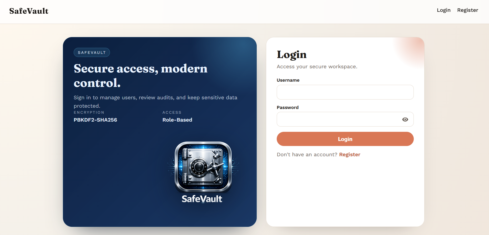
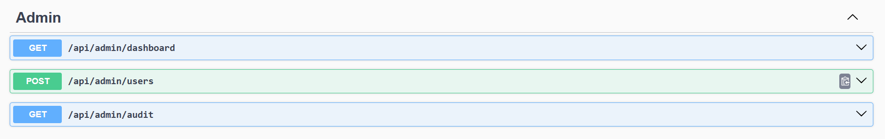
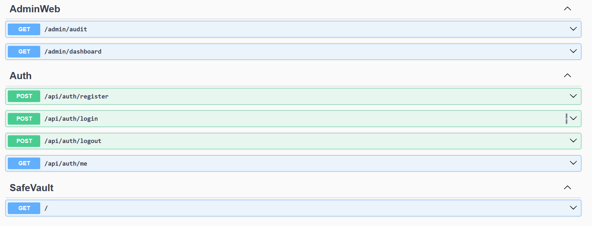
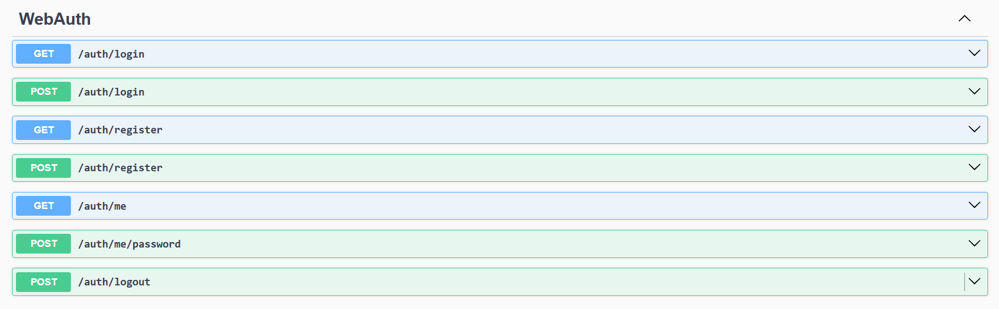

# SafeVault

Secure authentication and admin tooling for a small ASP.NET Core MVC app. Built with strong input validation, safe password hashing, and a modern UI for profile and admin workflows.

Highlights

- PBKDF2-SHA256 password hashing with per-user salts and timing-safe verify
- Role-based access control (Admin/User)
- Admin dashboard with user list, activity stats, and audit report
- Profile page with password update
- Security audit checks for common web vulnerabilities

## Tech stack

- ASP.NET Core MVC (.NET 9)
- EF Core 8 + Pomelo MySQL provider
- Razor views + custom CSS
- NUnit test suite

## Quick start

Prereqs:

- .NET 9 SDK
- MySQL 8+

1) Configure the database connection

```
appsettings.json -> ConnectionStrings:SecurityAuthentication
```

2) Create the schema

- Use `db.md` as the base schema.
- Ensure these tables exist and match the model:
  - `users`
  - `registration_requests`
  - `login_attempts`
  - `user_profiles`
  - `audit_logs`
  - `password_salts`

`login_attempts` reference schema:

```
CREATE TABLE login_attempts (
  id INT NOT NULL AUTO_INCREMENT,
  user_id INT NULL,
  success TINYINT(1) NOT NULL,
  ip_address VARCHAR(45) NULL,
  attempt_timestamp TIMESTAMP NULL DEFAULT CURRENT_TIMESTAMP,
  PRIMARY KEY (id),
  KEY user_id (user_id),
  CONSTRAINT login_attempts_ibfk_1
    FOREIGN KEY (user_id) REFERENCES users (id) ON DELETE SET NULL
);
```

3) Run the app

```
dotnet restore
dotnet run
```

4) Open the UI

- `http://127.0.0.1:5001/auth/login`

## Default admin

On first run, a default admin user is seeded if missing:

- username: `admin`
- password: `AdminPass123!`

Change this password after the first login.

## Web routes

- `GET /auth/login` login page
- `GET /auth/register` registration page
- `GET /auth/me` profile page (password update)
- `GET /admin/dashboard` admin dashboard
- `GET /admin/audit` audit report

## API routes

- `POST /api/auth/register`
- `POST /api/auth/login`
- `POST /api/auth/logout`
- `GET /api/auth/me`
- `GET /api/admin/dashboard` (admin only)
- `POST /api/admin/users` (admin only)
- `GET /api/admin/audit` (admin only)







Example login:

```
curl -X POST http://127.0.0.1:5001/api/auth/login \
  -H "Content-Type: application/json" \
  -d '{"username":"admin","password":"AdminPass123!"}'
```

Example admin create user:

```
curl -X POST http://127.0.0.1:5001/api/admin/users \
  -H "Content-Type: application/json" \
  -H "X-Session-Token: <session_token>" \
  -d '{"username":"newuser","email":"newuser@example.com","password":"StrongPass123!","role":"User"}'
```

## Tests

```
dotnet test
```

Test coverage includes input validation, authentication, authorization, repository safety, and security audit checks.

## Security notes

- Sessions are in-memory (`SessionService`) and not persisted.
- HTTPS redirection + security headers are configured in `Program.cs`.
- For production, move secrets to environment variables and configure a persistent session store.

## Production checklist

- CSP: lock down allowed script/style/image sources and remove inline `unsafe-inline`.
- Secrets: move DB credentials and any keys to environment variables or a secret manager.
- Logging: add structured logging with request IDs and audit trail retention.
- Session store: replace in-memory sessions with Redis or database-backed sessions.
